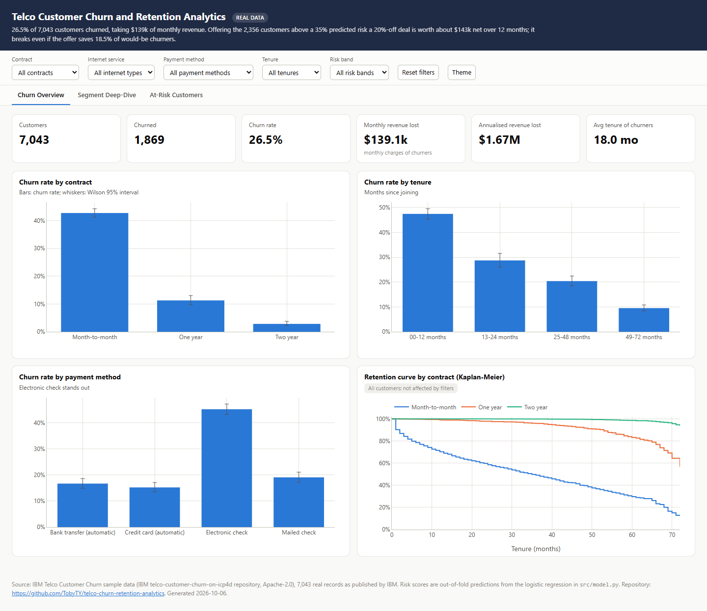
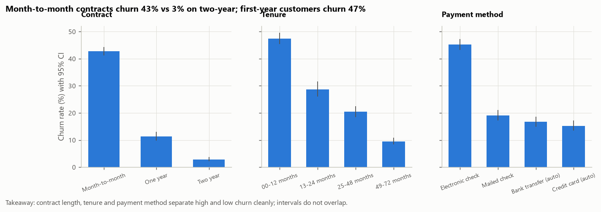
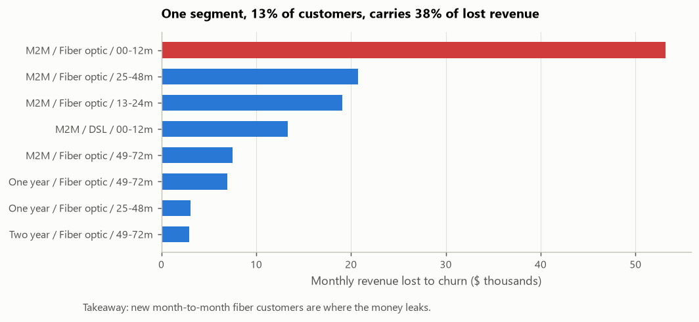
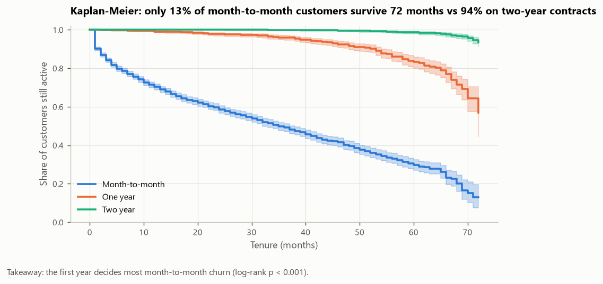
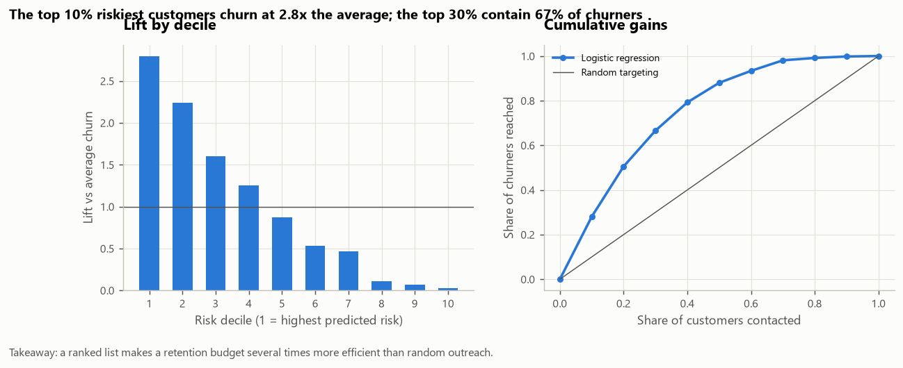
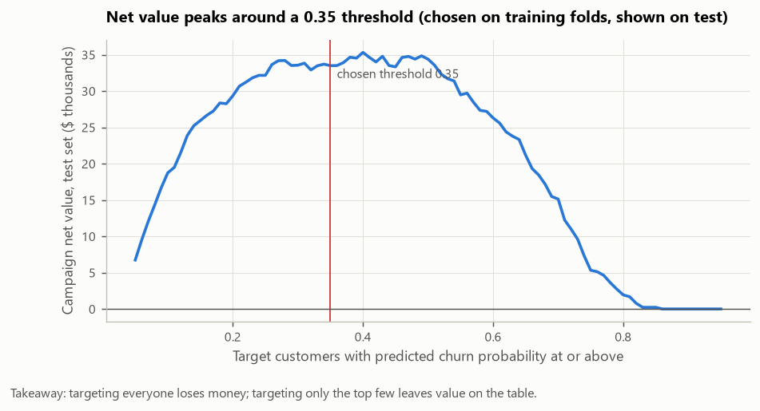

# Customer Churn and Retention Analytics (IBM Telco, real data)

**Live dashboard:** https://tobyty.github.io/telco-churn-retention-analytics/ · **Data:** IBM Telco Customer Churn sample, 7,043 customers, 21 fields

> **Headline: target the 2,356 customers above a 35% predicted churn risk with a 20%-off-for-6-months offer
> to save about $374k of revenue over 12 months.** Net of the $231k offer cost that is
> **$143k** (ROI 62%), and the campaign **breaks even if the offer saves 18.5% of would-be churners**
> (assumed: 30%). The group is 98% month-to-month and 78% fiber-optic customers;
> offering the same deal to everyone would lose $81.7k.



## Key numbers

| Metric | Value | Definition |
|---|---|---|
| Customers | 7,043 | One row per customer |
| Churn rate | 26.5% (1,869 customers) | `Churn = Yes`: left within the last month |
| Monthly revenue lost | $139k | Monthly charges of churned customers, 30.5% of all monthly revenue |
| Annualised revenue lost | $1.7M | Monthly revenue lost x 12 |
| Churners who left in their first year | 55% | Tenure of 12 months or less |
| Best model (test ROC-AUC / PR-AUC) | Logistic regression (0.847 / 0.638) | 25% stratified hold-out |
| Top-decile lift | 2.8x | Churn rate in the riskiest 10% vs the average |

## Answers to the five business questions

1. **Who churns?** Month-to-month customers churn 42.7% (95% CI 41.2% to 44.3%), against
   11.3% on one-year and 2.8% on two-year contracts. First-year customers churn 47.4%;
   fiber-optic 41.9%; electronic-check payers 45.3%; customers without tech support 41.6%.
   
2. **What does it cost?** $139k a month ($1.7M a year). Month-to-month contracts are 55% of customers but
   87% of the loss. One segment, new month-to-month fiber customers (916 people,
   13% of the base), churns 70% and carries 38% of lost revenue.
   
3. **Strongest drivers.** Chi-square tests with Cramer's V (categories) and Mann-Whitney with rank-biserial r (numbers), Bonferroni-corrected:
   tenure (months) (0.48), contract (0.41), online security (0.35), tech support (0.34).
   16 of 19 features are significant; gender is not (V = 0.009, p = 0.47).
   Kaplan-Meier: only 13% of month-to-month customers would still be active at 72 months, against
   94% on two-year contracts (log-rank p < 0.001).
   
4. **Risk scoring and its value.** Logistic regression, random forest and gradient boosting were compared with 5-fold stratified cross-validation.
   **The tree models did not beat the logistic-regression baseline** (CV ROC-AUC logistic regression 0.844, random forest 0.843, gradient boosting 0.838),
   so the simpler, explainable model is used. The riskiest 10% of test customers churn at 2.8x the average and the riskiest three deciles contain 67% of churners.
   
5. **Campaign break-even and best target group.** The offer costs $5.00 to deliver plus 20% of the bill for 6 months.
   Targeting threshold chosen to maximise net value on training folds: 0.35; on the untouched test set it reaches recall 72% at precision 55%.

   | Target group | Customers | Churn rate | Net value | ROI | Break-even save rate |
   |---|---|---|---|---|---|
   | **Model: probability >= 0.35** | 2,356 | 56.2% | **$143k** | 62% | 18.5% |
   | Rule: month-to-month + fiber + first year | 916 | 70.2% | $96.6k | 102% | 14.9% |
   | All month-to-month | 3,875 | 42.7% | $107k | 33% | 22.6% |
   | Everyone | 7,043 | 26.5% | -$81.7k | -14% | 34.9% |

   The rule-based group has the best ROI; the model group has the most net value because it also reaches high-risk customers outside the rule.
   

More detail: [executive summary](reports/executive_summary.md) · [insights and recommendations](reports/insights_and_recommendations.md) ·
[model card and leakage checks](docs/model_card.md) · [assumptions and cleaning log](docs/assumptions.md) · [project brief](docs/project_brief.md) · [interview notes](docs/interview_talking_points.md)

## Leakage check (summary)

`customer_id` and the derived bands are excluded; preprocessing is fitted inside each pipeline; train and test share no customers; a model trained on
shuffled labels scores test ROC-AUC 0.523 (chance); no single feature exceeds ROC-AUC 0.740; dropping
`total_charges` (the most "suspicious" field, since it grows with tenure) changes test ROC-AUC from 0.847 to 0.845.
Verdict: no leakage found. Details in [docs/model_card.md](docs/model_card.md).

## What is in the repo

| Path | Contents |
|---|---|
| `sql/` | `00_schema`, `01_staging_clean` (dedup, blank `TotalCharges`, bands), `02_analysis_views` (churn by segment with `RANK`, revenue at risk with running `SUM`, a manual Kaplan-Meier curve from window functions, `NTILE` charge deciles), `03_kpi_queries` |
| `src/` | Pipeline: download, DuckDB warehouse, audit, cleaning, EDA, statistics (`analysis.py`), models and campaign economics (`model.py`), Excel, dashboard, reports |
| `notebooks/` | `01_audit`, `02_cleaning`, `03_eda`, `04_analysis` (statistics and modelling), executed with outputs |
| `excel/retention_campaign_roi.xlsx` | Retention campaign ROI calculator: inputs with data validation, group selector, sensitivity table, chart; churn by segment with Wilson CIs as formulas |
| `dashboard/index.html` | Self-contained dashboard: Churn Overview, Segment Deep-Dive, At-Risk Customers (risk-band filter); served from `docs/` by GitHub Pages |
| `powerbi/` | Data model, 16 DAX measures, theme, layout and build guide (no `.pbix` committed) |
| `reports/` | `facts.json` (every published number), model comparison, lift table, segment table, executive summary, insights, figures |
| `tests/` | Data quality, SQL-vs-Python agreement, model protocol and leakage assertions, output consistency |

## Run it

```bash
python -m venv .venv && . .venv/bin/activate   # Windows: .venv\Scripts\activate
pip install -r requirements.txt
make all        # download -> warehouse -> audit -> clean -> eda -> analysis -> model -> excel -> dashboard -> reports -> notebooks -> test -> check
```

## Limitations

- IBM's sample is a single snapshot, so "churn" cannot be split by month and Kaplan-Meier treats tenure at the snapshot as follow-up time.
- Revenue figures are monthly charges, not margin; the campaign value is revenue retained, not profit.
- The save rate (30%) and the offer terms are assumptions; run the offer as a controlled test on part of the target list before rolling it out.
  The Excel calculator shows how the answer moves (net value is $18.2k at a 20% save rate and
  $267k at 40%).

Data licence: Apache-2.0 (IBM sample repository). Code licence: MIT.
